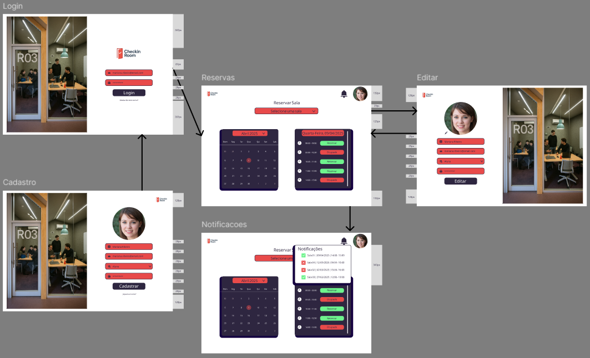
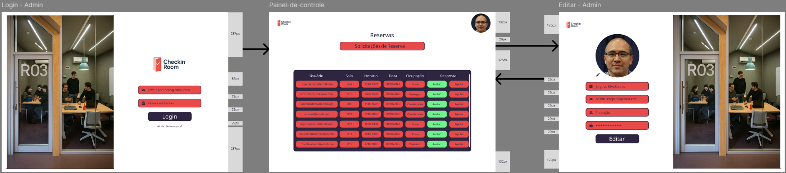
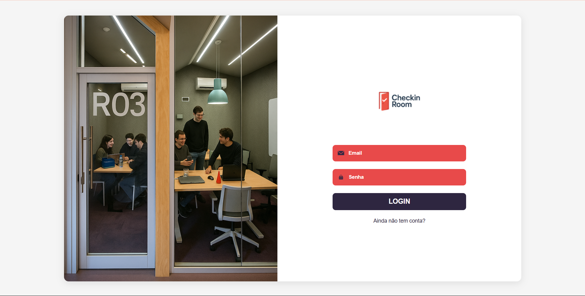
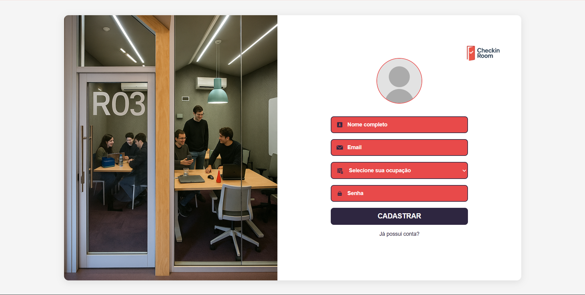
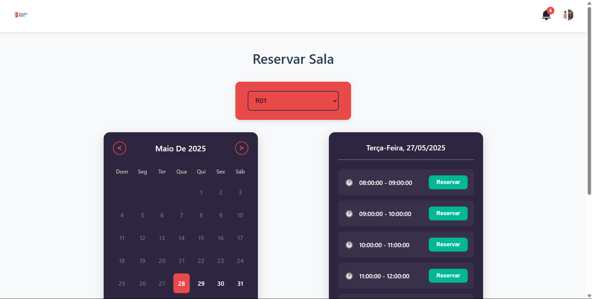
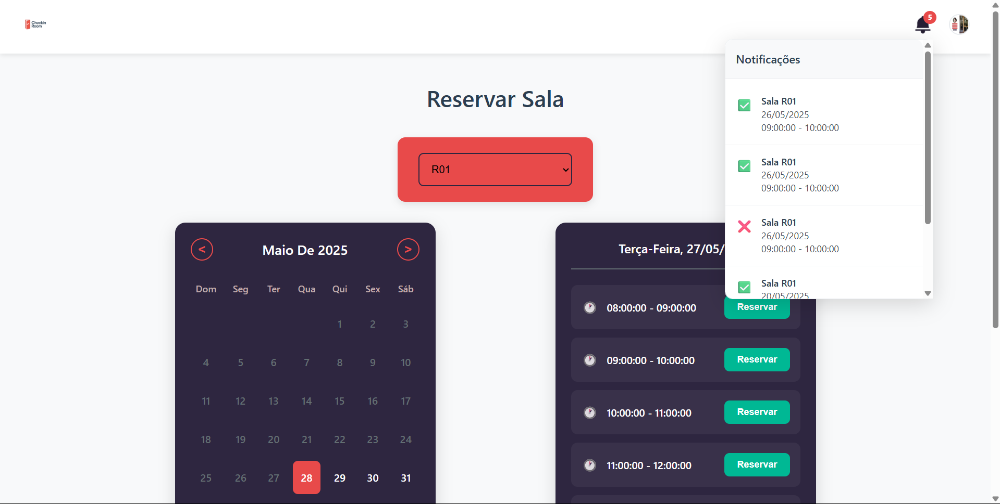
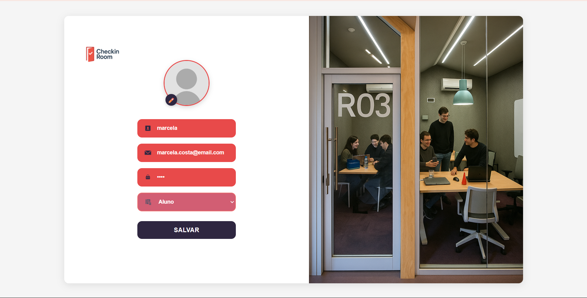
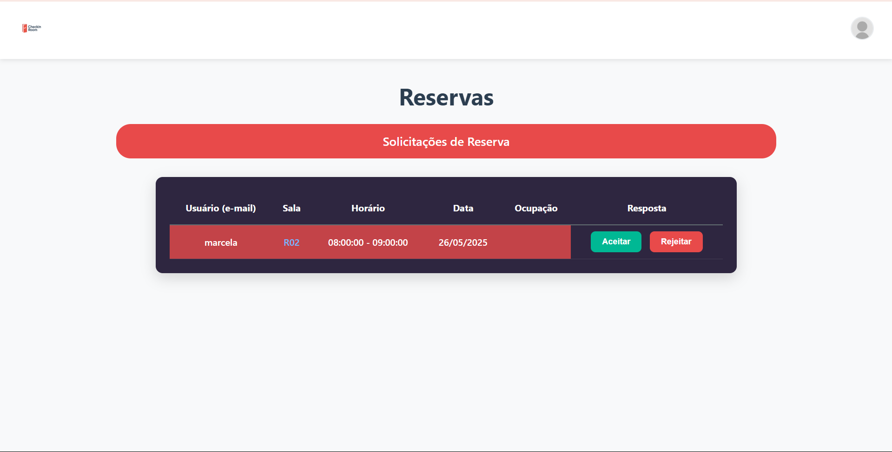

# Web Application Document - Projeto Individual - Módulo 2 - Inteli

## Checkin Room

#### Marcela Costa

## Sumário

1. [Introdução](#c1)  
2. [Visão Geral da Aplicação Web](#c2)  
3. [Projeto Técnico da Aplicação Web](#c3)  
4. [Desenvolvimento da Aplicação Web](#c4)  
5. [Referências](#c5)  

<br>

## <a name="c1"></a>1. Introdução
O sistema a ser desenvolvido tem como objetivo automatizar o processo de reserva de salas em ambientes acadêmicos ou institucionais. Atualmente, esse processo é frequentemente realizado de forma manual, o que pode acarretar em conflitos no agendamento desperdício de tempo. Com a criação desse sistema, será possível eliminar esses problemas por meio de uma plataforma digital intuitiva, que permitirá os usuários a consultarem a disponibilidade das salas em tempo real, realizar reservas facilmente e receber confirmações automáticas.

O sistema contará com funcionalidades como: dois tipos de login (usuário comum, administrador), visualização dos dias e horários disponíveis, opção para reserva mediante a disponibilidade e notificações para confirmação. O administrador terá acesso a um painel de controle para gerenciar os recursos, aprovar solicitações específicas e visualizar a posição da ocupação do usuário (estudante, professor e coordenador).

A interface será desenvolvida com foco na usabilidade, garantindo que qualquer pessoa consiga utilizar o sistema de maneira intuitiva. Dessa forma, com o processo de agendamento, o sistema proporcionará mais organização, economia de tempo e melhor aproveitamento dos espaços, contribuindo significativamente para a rotina dos usuários.

---

## <a name="c2"></a>2. Visão Geral da Aplicação Web

### 2.1. Personas

<div align="center">
  <sub>Persona</sub><br>
  
</div>

### 2.2. User Stories

**US01**  
Como estudante universitário, quero visualizar a disponibilidade das salas, para que eu possa escolher o melhor horário para estudar ou reunir meu grupo.

**US02**  
Como estudante universitário, quero poder reservar uma sala com antecedência, para que eu possa organizar a minha rotina de acordo com as minhas necessidades.

**US03**  
Como administrador, quero acessar o painel de controle, para que eu possa checar e aprovar as reservas para o uso das salas.

### Análise INVEST da User Story Prioritária

**US01 – Como estudante universitário, quero visualizar a disponibilidade das salas, para que eu possa escolher o melhor horário para estudar ou reunir meu grupo.**

- **I (Independente):** A história pode ser implementada separadamente da funcionalidade de reserva ou gestão administrativa.  
- **N (Negociável):** O formato de visualização (lista, calendário, etc.) pode ser ajustado conforme as necessidades dos usuários.  
- **V (Valiosa):** Permite que os estudantes escolham o melhor horário sem depender de terceiros, organizando melhor sua rotina.  
- **E (Estimável):** O escopo é claro e pode ser estimado pela equipe de desenvolvimento.  
- **S (Pequena):** Foca apenas na exibição da disponibilidade, sendo pequena e rápida de implementar.  
- **T (Testável):** Pode ser testada ao verificar se os horários livres estão sendo exibidos corretamente.

---

## <a name="c3"></a>3. Projeto da Aplicação Web

### 3.1. Modelagem do banco de dados

O modelo relacional a seguir apresenta a estrutura das tabelas do sistema de reserva de salas, com seus respectivos campos e relacionamentos. O sistema foi modelado para garantir integridade referencial, evitar conflitos de agendamento e permitir notificações automáticas aos usuários.

<div align="center">
  <sub>Modelo Relacional</sub><br>
  
</div>

#### Relações entre tabelas:

- **usuarios** → contém as informações de login e perfil dos usuários
- **salas** → define os ambientes disponíveis para reserva
- **horarios** → representa os horários fixos por sala e dia da semana
- **reservas** → associa usuários, salas, datas e horários em pedidos de reserva
- **notificacoes** → envia mensagens relacionadas ao status das reservas

As ligações entre tabelas utilizam chaves estrangeiras (`id_usuario`, `id_sala`, `id_horario`, `id_reserva`) para garantir consistência dos dados e facilitar o cruzamento de informações.

---

### Modelo Físico – Script SQL

Abaixo está o schema do banco de dados em SQL, que pode ser executado em Supabase ou PostgreSQL:

```sql
CREATE TABLE usuarios (
  id_usuario SERIAL PRIMARY KEY,
  nm_usuario TEXT NOT NULL,
  email_usuario TEXT UNIQUE NOT NULL,
  ocupacao_usuario TEXT NOT NULL CHECK (ocupacao_usuario IN ('aluno', 'professor', 'coordenador', 'recepcao')),
  senha_usuario TEXT NOT NULL
);

CREATE TABLE salas (
  id_sala SERIAL PRIMARY KEY,
  nm_sala TEXT NOT NULL
);

CREATE TABLE horarios (
  id_horario SERIAL PRIMARY KEY,
  id_sala INT REFERENCES salas(id_sala) ON DELETE CASCADE,
  horario_inicio TIME NOT NULL,
  horario_fim TIME NOT NULL,
  dia_semana TEXT NOT NULL CHECK (dia_semana IN ('segunda', 'terça', 'quarta', 'quinta', 'sexta', 'sábado', 'domingo'))
);

CREATE TABLE reservas (
  id_reserva SERIAL PRIMARY KEY,
  id_usuario INT REFERENCES usuarios(id_usuario) ON DELETE CASCADE,
  id_sala INT REFERENCES salas(id_sala) ON DELETE CASCADE,
  data_reserva DATE NOT NULL,
  id_horario INT REFERENCES horarios(id_horario) ON DELETE CASCADE,
  status_reserva TEXT NOT NULL CHECK (status_reserva IN ('pendente', 'aprovada', 'rejeitada'))
);

CREATE TABLE notificacoes (
  id_notificacao SERIAL PRIMARY KEY,
  id_usuario INT REFERENCES usuarios(id_usuario) ON DELETE CASCADE,
  id_reserva INT REFERENCES reservas(id_reserva) ON DELETE CASCADE,
  mensagem_notificacao TEXT NOT NULL,
  visualizada_notificacao BOOLEAN DEFAULT FALSE,
  data_notificacao TIMESTAMP DEFAULT CURRENT_TIMESTAMP
);
```

### 3.1.1 BD e Models

O sistema utiliza um banco de dados relacional PostgreSQL hospedado na plataforma Supabase. Os dados do sistema estão organizados em tabelas com as seguintes entidades principais:

#### Entidades do Banco de Dados

- **usuarios**
  - `id_usuario` (PK): Identificador único do usuário
  - `nome`: Nome completo
  - `email_usuario`: Email do usuário (único)
  - `senha_usuario`: Senha em texto plano (sem criptografia para fins de prototipagem)
  - `ocupacao_usuario`: Pode ser `aluno`, `professor`, `coordenador` ou `recepcao`

- **salas**
  - `id_sala` (PK): Identificador da sala
  - `nm_sala`: Nome ou número da sala (ex: Sala 1, Sala 2...)

- **horarios**
  - `id_horario` (PK): Identificador do horário
  - `dia_semana`: Dia da semana (opcional para futuras versões)
  - `horario_inicio`: Horário de início (ex: 08:00:00)
  - `horario_fim`: Horário de término (ex: 09:00:00)

- **reservas**
  - `id_reserva` (PK): Identificador da reserva
  - `id_usuario` (FK): Referência ao usuário que fez a reserva
  - `id_sala` (FK): Sala reservada
  - `data_reserva`: Data da reserva
  - `id_horario` (FK): Horário reservado
  - `status_reserva`: Pode ser `pendente`, `aprovada` ou `rejeitada`

- **notificacoes**
  - `id_notificacao` (PK): Identificador da notificação
  - `id_usuario` (FK): Usuário que receberá a notificação
  - `id_reserva` (FK): Reserva relacionada
  - `mensagem_notificacao`: Texto da notificação (ex: "Sua reserva foi aprovada")
  - `visualizada_notificacao`: Booleano que indica se a notificação já foi lida
  - `data_criacao`: Data/hora em que a notificação foi criada

#### Models com Validação (Joi)

Além da modelagem no banco de dados, o sistema implementa validações em nível de aplicação por meio da biblioteca `Joi`. Os arquivos de validação estão localizados na pasta `models/`:

- `usuarioModel.js`: Valida nome, email, senha e ocupação
- `reservaModel.js`: Valida id da sala, horário, data e status
- `notificacaoModel.js`: Valida id do usuario, id da reserva, mensagem de notificacao, visualizacao e data

### 3.2 Arquitetura

O sistema web segue uma arquitetura baseada no padrão **MVC estendido**, com separação clara entre as responsabilidades das camadas. A arquitetura foi adaptada para manter o projeto modular e de fácil manutenção, incorporando camadas intermediárias de **services** e **repositories**.

<div align="center">
  <sub>Diagrama de Arquitetura</sub><br>
  <br>
  <a href="https://www.figma.com/design/rbwxwsD2TCtxKSFSgmsAzJ/Untitled?node-id=0-1&t=ElXLSMoT2ghOvWdu-1" target="_blank">
    <sup>Link Figma</sup>
  </a><br>
</div>

---

#### Fluxo de Dados

- **Views**: arquivos `.ejs` localizados na pasta `views/`. São responsáveis por exibir o conteúdo ao usuário e coletar entradas de dados (login, cadastro, reservas, etc).

- **Controllers**: recebem requisições HTTP, processam os dados de entrada, chamam os serviços adequados e retornam a resposta. Também gerenciam o fluxo entre views e regras de negócio.

- **Services**: camadas intermediárias que concentram a lógica de negócio. Realizam validações, processam regras, organizam dados e acionam os repositórios quando necessário.

- **Repositories**: são responsáveis por executar diretamente as queries no banco de dados PostgreSQL (via Supabase), de forma organizada e desacoplada da lógica de negócio.

- **Models**: usam a biblioteca `Joi` para validar os dados de entrada antes que cheguem ao banco de dados.

- **Banco de Dados**: hospedado no **Supabase**, armazena entidades como `usuarios`, `reservas`, `notificacoes`, `salas` e `horarios`.

---

#### Resumo dos fluxos principais

- **Login e Cadastro**: dados entram via `login.ejs` e `cadastro.ejs`, passam pelo `UsuarioController`, são validados via `usuarioModel` e persistidos via `usuarioRepository`.

- **Reserva de Salas**: o `ReservaController` exibe horários disponíveis, chama `reservaService` para validar conflitos e cria reservas via `reservaRepository`.

- **Painel da Recepção**: o `ReservaController` lista reservas pendentes e envia decisões (aprovar/rejeitar). Essas ações também geram notificações.

- **Notificações**: o `NotificacaoController` acessa notificações do usuário, renderiza na view `notificacoes.ejs` e interage com `notificacaoRepository`.

### 3.3. Wireframes

<div align="center">
  <sub>Wireframe Fluxo do Usuário</sub><br>
  <br>
  <a href="https://www.figma.com/design/ciAqelvhj4Sv3JKkpFbmJx/telas-projeto-individual?node-id=0-1&t=Wfa7iskOhhJL5R7h-1" target="_blank">
    <sup>Link Figma</sup>
  </a><br>
  <sup>O wireframe do usuário contempla as funcionalidades descritas nas US01 e US02. Através da interface, o estudante pode realizar login, visualizar a disponibilidade das salas por data e horário (US01) e, a partir disso, realizar reservas de forma antecipada com base na sua preferência e necessidade (US02). A tela de cadastro e a de edição de perfil garantem uma personalização da experiência do usuário, enquanto a aba de notificações permite que o usuário acompanhe o status das suas solicitações.</sup>
</div>

<div align="center">
  <sub>Wireframe Fluxo do Administrador</sub><br>
  <br>
    <a href="https://www.figma.com/design/ciAqelvhj4Sv3JKkpFbmJx/telas-projeto-individual?node-id=17-335&p=f" target="_blank">
    <sup>Link Figma</sup>
  </a><br>
  <sup>O wireframe do administrador oferece uma visão centralizada das solicitações de reserva por meio de um painel de controle (US03). Nessa interface, o admin consegue visualizar todos os pedidos de reserva com informações como nome do usuário, sala, horário, data e ocupação para que ele possa priorizar as reservas e evitar conflitos de horário, além de ter a opção de aprovar ou rejeitar as solicitações. A funcionalidade de login e edição de perfil também estão presentes, garantindo segurança e controle de acesso.</sup>
</div>

### 3.4. Guia de Estilos

O guia de estilos do sistema **Checkin Room** foi desenvolvido para garantir consistência visual, acessibilidade e clareza na interação com o usuário. Abaixo estão os principais elementos que compõem o estilo visual da aplicação:

#### Tipografia

* **Fonte principal:** Utilizada em títulos, botões e textos importantes.
* **Hierarquia:** H1, H2, H3 e parágrafos organizam a informação por importância.

#### Paleta de Cores

| Cor         | Código    | Uso                                             |
| ----------- | --------- | ----------------------------------------------- |
| Roxo escuro | `#2E2640` | Títulos, ícones e botões principais             |
| Vermelho    | `#E84A4A` | Alertas, botões "Rejeitar", reservas rejeitadas |
| Verde       | `#6EF38D` | Botões "Aceitar", reservas aprovadas            |
| Cinza claro | `#C1ADAD` | Divisores e elementos de apoio                  |
| Branco      | `#FFFFFF` | Fundo e contraste                               |

#### Ícones

* **Envelope:** Campo de e-mail
* **Pessoa:** Campo de nome
* **Carteira de trabalho:** Campo de ocupação
* **Cadeado:** Campo de senha
* **Lápis:** Editar imagem do perfil
* **Sino:** Acessar notificações
* **✔️ / ❌:** Indicam aprovação ou rejeição da reserva

#### Layout e Estética

* A interface é limpa, com espaçamento adequado e botões grandes e clicáveis.
* Cada componente visual (botões, campos de texto, modais) segue padrões definidos, otimizando a experiência do usuário e facilitando a navegação.

#### Guia Visual

<div align="center">
  <sub>Guia de Estilos</sub><br>
  <br>
  <a href="https://www.figma.com/design/ciAqelvhj4Sv3JKkpFbmJx/telas-projeto-individual?node-id=34-2&p=f" target="_blank">
    <sup>Link Figma</sup>
  </a><br>
</div>

---

### 3.5. Protótipo de alta fidelidade

O protótipo de alta fidelidade foi desenvolvido para representar com precisão a experiência final do usuário na aplicação. Ele contempla todas as interações principais, incluindo o fluxo do usuário comum com: Cadastro, Login, Reservas, Notificaçãoe e Editar Perfil. E também o fluxo do Administrador (recepção), Painel de Controle e Editar Perfil. Com o protótipo de alta fidelidade criado é possível utilizá-lo como base para o desenvolvimento do front-end, facilitando a validação as users stories e garantindo que as implementações sigam o planejamento de usabilidade e identidade visual definidos no guia de estilos.

<div align="center">
  <sub>Protótipo de Alta Qualidade - User</sub><br>
  <br>
  <a href="https://www.figma.com/design/ciAqelvhj4Sv3JKkpFbmJx/telas-projeto-individual?node-id=34-2&p=f" target="_blank">
    <sup>Link Figma</sup>
  </a><br>
</div>

<div align="center">
  <sub>Protótipo de Alta Qualidade - Admin</sub><br>
  <br>
  <a href="https://www.figma.com/design/ciAqelvhj4Sv3JKkpFbmJx/telas-projeto-individual?node-id=34-2&p=f" target="_blank">
    <sup>Link Figma</sup>
  </a><br>
</div>

### 3.6 WebAPI e Endpoints

Aqui estão descritos todos os endpoints implementados no sistema Checkin Room. A API segue o padrão RESTful, utilizando o framework **Express** no back-end para receber e processar requisições HTTP. Os endpoints foram organizados por módulo funcional para facilitar a navegação e compreensão. Cada rota trata uma funcionalidade específica, como autenticação, manipulação de reservas ou exibição de notificações ao usuário.

---

#### Autenticação e Usuários (`/usuarios`)

| Método | Rota              | Descrição                                     |
|--------|-------------------|-----------------------------------------------|
| POST   | `/usuarios`       | Criação de novo usuário (cadastro)            |
| POST   | `/login`          | Autenticação de usuário (login)               |
| GET    | `/editar-perfil`  | Exibe formulário de edição do perfil          |
| POST   | `/editar-perfil`  | Atualiza os dados do usuário logado           |
| GET    | `/usuarios/:id`   | Retorna os dados de um usuário específico     |
| PUT    | `/usuarios/:id`   | Atualiza dados de um usuário específico       |
| DELETE | `/usuarios/:id`   | Remove um usuário do sistema                  |

---

#### Reservas (`/reserva` e `/reservas`)

| Método | Rota                         | Descrição                                       |
|--------|------------------------------|-------------------------------------------------|
| GET    | `/reserva`                   | Exibe o formulário de reserva                   |
| POST   | `/reserva`                   | Cria uma nova reserva de sala                   |
| POST   | `/reserva/disponiveis`       | Lista horários disponíveis para sala e data     |

---

#### Painel da Recepção (`/painel-admin`)

| Método | Rota                                | Descrição                               |
|--------|-------------------------------------|-----------------------------------------|
| GET    | `/painel-admin`                     | Exibe reservas pendentes para aprovação |
| POST   | `/reservas/:id/aprovar`             | Aprova a reserva                        |
| POST   | `/reservas/:id/rejeitar`            | Rejeita a reserva                       |

---

#### Notificações (`/notificacoes`)

| Método | Rota                | Descrição                                           |
|--------|---------------------|-----------------------------------------------------|
| GET    | `/notificacoes`     | Lista notificações do usuário logado                |

---

**Observação:** o sistema utiliza `express-session` para manter a sessão de login e validar qual usuário está autenticado nas rotas protegidas.

### 3.7 Interface e Navegação

O desenvolvimento do front-end do sistema **Checkin Room** foi realizado visando as necessidades do usuário, com uma interface simples, intuitiva e uma identidade visual coerente e padronizado. O desenvolvimento da aplicação e estilização do front-end foi baseado no protótipo de alta fidelidade elaborado previamente. Abaixo estão as principais telas implementadas e o papel de cada uma na experiência do usuário.

#### Tela de Login
Permite que usuários acessem o sistema com e-mail e senha. O layout divide a tela entre uma imagem institucional e o formulário, reforçando a identidade da instituição.

<div align="center">
  <sub>Tela de Login</sub><br>
  <br>
</div>

#### Tela de Cadastro
Usuários podem criar uma conta informando nome, e-mail, ocupação, senha e adicionando uma foto de perfil. O botão "+" possibilita o upload da imagem. O design segue o padrão visual da tela de login.

<div align="center">
  <sub>Tela de Cadastro</sub><br>
  <br>
</div>

#### Tela de Reservas
Após o login, os usuários são direcionados à tela de reserva de salas. Nela é possível selecionar a sala desejada, escolher a data em um calendário interativo e visualizar os horários disponíveis. A interface é clara e objetiva.

<div align="center">
  <sub>Tela de Reservas</sub><br>
  <br>
</div>

#### Pop-up de Notificações
Ao clicar no ícone de sino no canto superior direito, um pop-up exibe as notificações de reservas aprovadas ou rejeitadas. Cada item contém a sala, data, horário e um ícone visual indicando o status.

<div align="center">
  <sub>Pop up Notificações</sub><br>
  <br>
</div>

#### Tela de Editar Perfil
Permite que o usuário visualize e edite seus dados, incluindo nome, e-mail e senha, além de trocar a foto de perfil clicando no ícone de lápis. O botão "Salvar" atualiza as informações e redireciona para a tela de reservas.

<div align="center">
  <sub>Tela de Editar Perfil</sub><br>
  <br>
</div>

#### Painel de Controle (Admin)
Disponível para usuários com perfil de recepção, esse painel lista todas as solicitações de reserva. É possível visualizar os dados de cada requisição e responder com as opções "Aceitar" ou "Rejeitar".

<div align="center">
  <sub>Tela do Painel de Controle</sub><br>
  <br>
</div>

---

## <a name="c4"></a>4. Desenvolvimento da Aplicação Web

### 4.1 Demonstração do Sistema Web

**VIDEO:**  
<div align="center">
  <sub>Fluxo do Usuário</sub><br>
  <video src="assets/video-user-pi.mp4" width="85%" controls loop></video><br>
</div>

<div align="center">
  <sub>Fluxo do Administrador</sub><br>
  <video src="assets/video-admin-pi.mp4" width="85%" controls loop></video><br>
</div>

Nesta etapa final do projeto, o sistema web foi totalmente implementado, integrando backend e frontend, com funcionalidades específicas para dois tipos de perfis: usuários comuns (alunos, professores e coordenadores) e o perfil de recepção (admin).

#### Fluxo do Usuário
O vídeo demonstra o fluxo completo de um usuário comum, incluindo:
- Tela de **Login**, com layout dividido entre uma imagem institucional e campos de autenticação.
- Tela de **Cadastro**, com inserção de dados pessoais, ocupação e upload de foto de perfil.
- Página de **Reservas**, que permite ao usuário selecionar uma sala, visualizar o calendário interativo e reservar horários disponíveis.
- **Notificações**, acessadas pelo ícone de sino no canto superior direito, com feedback visual (✓ ou ✗) para aprovações e rejeições.
- Tela de **Edição de Perfil**, acessada pela imagem do usuário, permitindo alteração de dados e foto.

Prints:
<div align="center">
  <sub>Tela de Login</sub><br>
  <br>
</div>
<div align="center">
  <sub>Tela de Cadastro</sub><br>
  <br>
</div>
<div align="center">
  <sub>Tela de Reservas</sub><br>
  <br>
</div>
<div align="center">
  <sub>Pop-up de Notificações</sub><br>
  <br>
</div>
<div align="center">
  <sub>Tela de Editar Perfil</sub><br>
  <br>
</div>

#### Fluxo do Administrador
O segundo vídeo demonstra o fluxo da recepção:
- Acesso à tela de **Login** como admin (usuário com ocupação “recepção”).
- Redirecionamento para o **Painel de Controle**, onde o admin pode visualizar todas as solicitações de reserva em uma tabela com dados do usuário, sala, data e horário.
- O administrador pode **aceitar ou rejeitar** reservas com um clique, e o sistema envia automaticamente uma notificação ao usuário solicitante.

Prints:
<div align="center">
  <sub>Tela do Painel de Controle</sub><br>
  <br>
</div>

#### Tecnologias e Entregas
- **Frontend**: HTML, CSS customizado e JavaScript (sem frameworks).
- **Backend**: Node.js com Express e integração com PostgreSQL.
- **Banco de dados**: modelagem relacional com controle de reservas, usuários, salas e horários.
- **Upload e exibição de imagem de perfil** com armazenamento local.

### 4.2 Conclusões e Trabalhos Futuros

O desenvolvimento do sistema Checkin Room proporcionou uma experiência completa de construção de uma aplicação web funcional, desde o back-end com autenticação e gerenciamento de dados em banco de dados, até o front-end com foco em usabilidade e responsividade. O sistema atendeu aos principais objetivos definidos no início do projeto: permitir o cadastro de usuários com diferentes perfis, reserva de salas por data e horário, além do controle de aprovações por parte da recepção.

**Pontos fortes:**
- Interface amigável, moderna e adaptada ao público-alvo.
- Navegação intuitiva com fluxo claro para usuários comuns e administradores.
- Funcionalidade de notificações em tempo real via pop-up.
- Calendário customizado com seleção de datas e exibição de horários disponíveis.
- Upload e edição de imagem de perfil integrada ao banco de dados.

**Pontos a melhorar:**
- Implementar validação visual de formulários no front-end (ex: campos obrigatórios).
- Melhorar feedbacks visuais após ações como “Reserva feita” ou “Perfil atualizado”.
- Incluir mensagens de erro personalizadas para facilitar a identificação de problemas.

**Trabalhos futuros e ideias:**
- Adicionar filtro por sala, data ou usuário no painel de controle para facilitar a gestão de reservas.
- Implementar envio de notificações por e-mail ou push.
- Criar um sistema de histórico de reservas para usuários.
- Adicionar a opção de cancelar uma reserva ou reagendar.
- Possibilitar integração com serviços de calendário (Google Calendar ou Outlook).

## <a name="c5"></a>5. Referências

_Incluir as principais referências de seu projeto, para que seu parceiro possa consultar caso ele se interessar em aprofundar. Um exemplo de referência de livro e de site:_<br>

---
---
